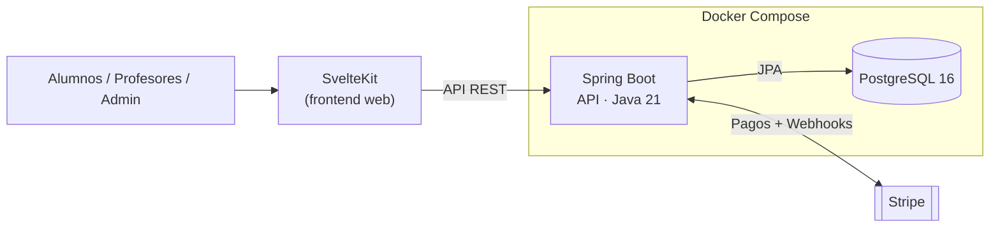

# Gestor de Academias

**Plataforma full-stack (mi TFG — Trabajo Fin de Grado) para gestionar una academia de principio a fin: matrícula de alumnos, calificaciones y pagos, todo en una sola herramienta.**


---

## El problema

Llevar una academia significa hacer malabares entre hojas de cálculo sueltas, cobros manuales y correos para entregar notas y material. Es frágil, lento y se rompe en cuanto crece el número de alumnos.

Esta plataforma unifica **matrícula, calificaciones y pagos** en un único sistema, con cada rol viendo exactamente lo que necesita y los cobros automatizados de extremo a extremo.

---

## Cómo funciona



**Decisiones técnicas clave:**

- **Control de acceso por roles** — Admin, Profesor y Alumno. Spring Security con OAuth2 + JWT asegura que cada usuario solo accede a lo suyo (gestión global, docencia o su propio progreso).
- **Pagos con Stripe** — cobros seguros y automatizados; los *webhooks* actualizan el estado de cada pago sin intervención manual.
- **Diseñado para 1000 usuarios concurrentes** — API REST *stateless* sobre Spring Boot y PostgreSQL relacional, pensada para escalar bajo carga.
- **API contract-first** — el cliente TypeScript del frontend se genera desde el OpenAPI del backend (springdoc), evitando desajustes entre front y back.
- **Observabilidad incluida** — Actuator + Micrometer/Prometheus para métricas en producción.

---

## Stack

| Capa         | Tecnologías |
|--------------|-------------|
| **Frontend** | SvelteKit 2.16 · Svelte 5 · Tailwind CSS 4 · Flowbite · TypeScript · Vite · `@stripe/stripe-js` |
| **Backend**  | Java 21 · Spring Boot 3.5.3 · Spring Security (OAuth2 + JWT) · Spring Data JPA · HATEOAS · springdoc OpenAPI |
| **Infra**    | PostgreSQL 16 · Docker Compose · Actuator + Micrometer/Prometheus |

---

## En números

> - **1000** usuarios concurrentes como objetivo de diseño
> - **3** roles con permisos diferenciados (Admin · Profesor · Alumno)
> - **1** comando para levantar todo el stack con Docker
> - **3** dominios unificados: matrícula · calificaciones · pagos

---

## Ejecutar en local

### Opción rápida — todo con Docker

Levanta la base de datos y la API juntas:

```bash
cd backend/app
docker-compose up --build -d
```

La API queda disponible en `http://localhost:8080`.

### Opción desarrollo

**1. Solo la base de datos** (para desarrollar el backend desde el IDE):

```bash
cd backend/app
docker-compose -f docker-compose.db.yml up -d
```

**2. Backend** (Spring Boot, puerto 8080):

```bash
cd backend/app
./mvnw spring-boot:run
```

**3. Frontend** (SvelteKit + Vite):

```bash
cd frontend
npm install
npm run dev
```

**4. Webhooks de Stripe** (opcional, para probar pagos en local):

```bash
cd frontend
npm run stripe
```
